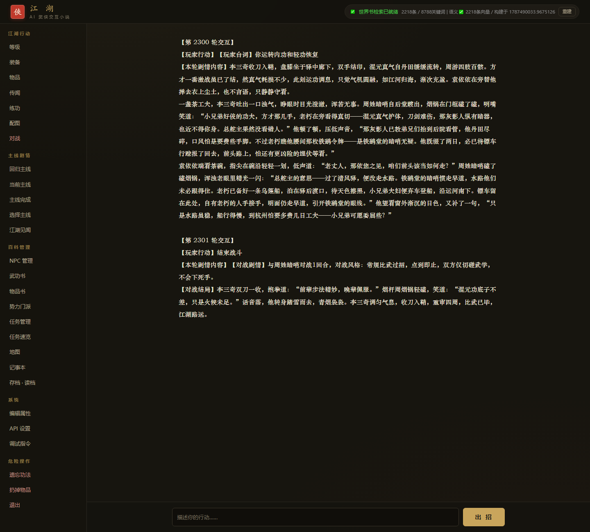
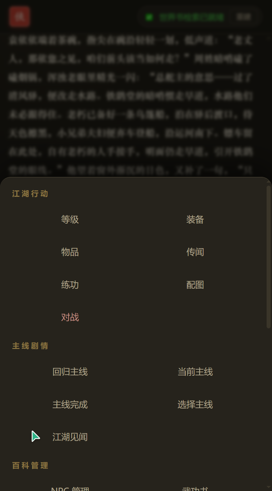

# AI Wuxia Interactive Novel RPG

[中文说明](README.md) | English

An interactive wuxia novel driven by large language models. You play a modern person transported into Jin Yong's martial arts world — practice kung fu, wander the jianghu, take revenge, hunt for treasure. The story is generated by AI in real time; there is no fixed script.

Free and open source, for learning and personal enjoyment only.

## Screenshots

Desktop: grouped command navigation on the left, story reading area in the center, action input at the bottom.

<p align="center">
  
</p>

Mobile: commands live in a bottom drawer (tap the "☰ 命令" button to open it), and popups go full-screen.

<p align="center">
  
</p>

## What You Get

- Free-form story generation: you write one action, the AI continues the story
- Dice checks: your moves roll a d20, and the outcome actually shapes the plot — the AI can't just make things up
- Kung fu training: 14 mastery tiers, from raw beginner up to "Shattered Void"
- Turn-based combat, including one-on-one duels with NPCs
- 276 NPCs, each with their own identity, personality, secrets, and an affection score — they remember what you did
- Worldbook retrieval: 2,000+ lore entries injected on demand, so the AI sticks to the setting
- A main quest line built from original novel episodes, which you can also skip around
- Play in the browser — works on both desktop and mobile, with panels for the map, quests, equipment, and more

## Requirements

- Python 3.10+
- An LLM API key (DeepSeek or any OpenAI-compatible endpoint works)

Optional: an Alibaba Cloud Bailian key (cloud long-term memory) and a SiliconFlow key (NPC portraits and story illustrations).

## Setup

**1. Get the code and install dependencies**

```bash
git clone https://github.com/charnamel/ai-wuxia-novel-rpg.git
cd ai-wuxia-novel-rpg
python -m venv venv
venv\Scripts\activate        # Linux/macOS: source venv/bin/activate
pip install -r requirements.txt
```

The core dependencies are small. The semantic search group (sentence-transformers, which pulls in torch) is heavy — the game runs fine without it and falls back to keyword-only search.

**2. Configure your API key**

Copy `.env.example` to `.env` and fill in your keys. The minimum is two lines:

```ini
MAIN_LOOP_A_API_KEY=sk-xxx
AUX_A_API_KEY=sk-xxx
```

The main-loop model generates the story; the auxiliary model handles state extraction and dice checks. Both are required, and they can be the same provider. `.env.example` includes examples for DeepSeek's official API and OpenCode Go (one key gives you deepseek-v4-flash, gpt-5.6-luna, grok-4.5, and more). Everything else — image generation, cloud memory — is optional.

**3. Prebuild the semantic vector index (optional, recommended)**

```bash
pip install sentence-transformers numpy
python build_semantic_index.py
```

The first run downloads a Chinese embedding model (about 95MB) and takes a minute or two to encode everything. After that it's fully cached and offline. You can skip this — the game still works, but the first semantic search will stall for 30 seconds to 2 minutes.

**4. Start the game**

```bash
python run.py
```

Open http://localhost:5000 in your browser and create a character. Phones on the same LAN can connect too.

**5. Server deployment (optional)**

```bash
pip install gunicorn
gunicorn -w 1 -b 0.0.0.0:5000 --timeout 300 run:app
```

Keep exactly 1 worker — game state lives in local JSON files, and multiple workers would overwrite each other. Give it a generous timeout (AI story generation is slow); same goes for Nginx if you put one in front. For details and troubleshooting, see the [deployment guide](docs/01-部署指南.md) (in Chinese).

## How to Play

After creating a character, just describe what you do in a sentence — for example, "I look around the inn."

A few things worth knowing:

- Mentioning a martial art (by name, or phrases like "channeling my inner force") brings up a dice check panel; confirm to roll
- Checks favor the art you named, then your equipped internal/lightness skills
- Interactions with NPCs build affection, which shapes their attitude and the story
- "Return to Main Quest" triggers the next episode from the original novel; finish it with "Main Quest Complete" to unlock the next one
- Pick a location on the map to travel there

## Project Layout

Twenty Python files at the core; the main ones:

- `main.py` — the main loop: story generation and state updates
- `web_server.py` — web service
- `dice_system.py` — dice checks
- `battle_system.py` — combat
- `worldbook.py` — worldbook retrieval
- `player_manager.py` — player data
- `data/` — static game data (NPCs, martial arts, map, main quest, etc.)

The `docs/` folder goes deeper (all in Chinese):

- [Deployment Guide](docs/01-部署指南.md)
- [Worldbook Engine](docs/02-世界书引擎.md)
- [Local Semantic Search](docs/03-本地语义向量检索.md)
- [Game Modules](docs/04-游戏模块详解.md)

## Acknowledgements

The dice check and AI tabletop-RPG design of this project was inspired by [DiceFrame](https://github.com/diceframe/diceframe) — thanks for the inspiration.

## License

The code is open source under the MIT license, for learning and exchange only, no commercial use. The setting and characters are fan works based on Jin Yong's novels; all related rights belong to Jin Yong and the copyright holders. AI-generated content is for entertainment only.
